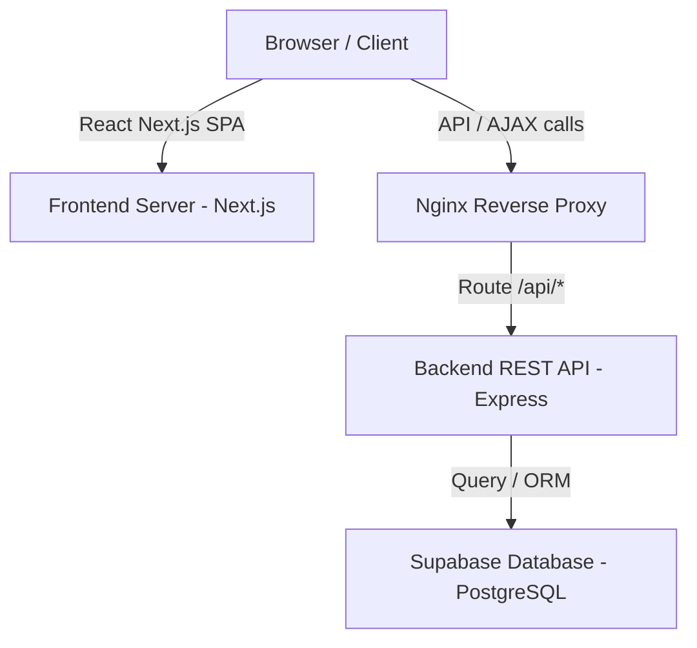

# Portfolio System Architecture

A high-level overview of the professional MERN / Next.js architecture designed for the personal portfolio.

---

## Architecture Flow Diagram

## System Components

### 1. Frontend
* Built using Next.js utilizing the Pages Router configuration to ensure optimal page rendering speeds.
* Styled using custom consolidated Vanilla CSS rules defined in a global location (`globals.css`) alongside clean theme togglers.
* Equipment custom, smooth 50ms follow cursor lag ring tracking user movements.

### 2. Backend
* Built using Node.js and Express to expose CORS-enabled API routes.
* Modularly designed to segregate routing paths, controller actions, database helper models, and exception handlers.

### 3. Database
* Backed by PostgreSQL hosted on Supabase.
* Submissions submitted via the contact screens are stored in a fully-indexed table structure to guarantee optimal performance.
